# Money Graph — AML Financial Flow Intelligence Platform

<p align="center">
  
  
  
  
  
  
  
</p>

<p align="center">
  <a href="#english">English</a> • <a href="#русский">Русский</a> • <a href="#screenshots--media--скриншоты-и-демо">Screenshots & Demo</a>
</p>

---

## Screenshots & Media / Скриншоты и Демо

> **Media Showcase Placeholder**
> Add visual assets, UI walk-through screenshots, and screen recordings below.

### Application Walkthrough Video
<!-- VIDEO: Add demo video embed / link here -->
<!-- Example: [](https://your-video-link.com) -->
<div align="center">
  <p><i>📹 [Video Demo Placeholder - Upload or link your 1-2 min video walk-through here]</i></p>
</div>

<br/>

### Key Interface Screenshots

| **Interactive Graph Visualizer** | **Priority Investigation Queue & Escalation** |
|:---:|:---:|
| <!-- SCREENSHOT: Graph Canvas View with Directed Flows and Roles --> <div align="center"><br/><i>🖼️ [Screenshot Placeholder: Canvas Graph View]</i><br/><br/></div> | <!-- SCREENSHOT: Priority Queue Table with Filter Badges and Status --> <div align="center"><br/><i>🖼️ [Screenshot Placeholder: Investigation Queue]</i><br/><br/></div> |

| **Client Dossier & Counterparty Breakdown** | **Community Clusters & Sensitivity Tuning** |
|:---:|:---:|
| <!-- SCREENSHOT: NodeCard side panel showing inbound/outbound topology --> <div align="center"><br/><i>🖼️ [Screenshot Placeholder: Client Dossier Panel]</i><br/><br/></div> | <!-- SCREENSHOT: Cluster Bubble Map / Threshold Sensitivity Drawer --> <div align="center"><br/><i>🖼️ [Screenshot Placeholder: Clusters & Sensitivity]</i><br/><br/></div> |

| **AI AML Assistant Drawer** | **Bilingual Support (Russian / English UI)** |
|:---:|:---:|
| <!-- SCREENSHOT: AI Assistant panel explaining laundering typologies --> <div align="center"><br/><i>🖼️ [Screenshot Placeholder: AI Assistant Chat]</i><br/><br/></div> | <!-- SCREENSHOT: Russian Language Mode Layout --> <div align="center"><br/><i>🖼️ [Screenshot Placeholder: Russian Language UI]</i><br/><br/></div> |

---

<a name="english"></a>
# English

## Overview
**Money Graph** is an end-to-end financial transaction network reconstruction and role attribution platform built for financial crime investigation and compliance units. It processes multi-hop bank transaction exports (`edges.parquet`, `nodes.parquet`, `transactions.parquet`), builds a directed weighted graph, computes network centrality and community metrics, deterministically attributes roles to 2,248 accounts, ranks investigation targets by priority score, and presents an interactive visual dashboard with an embedded AML AI Assistant.

### Key Capabilities
- **6-Role Deterministic Attribution**: Coordinator, Consolidator, Distributor, Transit, Terminal, Peripheral with objective rule-tracing chains.
- **Priority Investigation Queue & Case Escalation**: Triage target accounts, tag status (`unreviewed`, `escalated`, `cleared`), add analyst notes, and export official Law Enforcement Referral Dossiers (CSV & printable PDF).
- **Interactive 60 FPS Canvas Graph**: GPU-friendly visualizer with directional arrows, volume-proportional edges, cluster coloring, and hop-neighborhood filtering.
- **Threshold Sensitivity Analysis**: Adjust coordinator betweenness percentiles, consolidator fan-in, and distributor fan-out thresholds dynamically.
- **Data Completeness & Limitation Audit**: Identifies 444 depth-4 boundary artifacts, cutoff constraints (5,000 KZT minimum), and outward-only tracing boundaries.
- **AI AML Assistant**: Natural language querying over account topological signatures, rapid lookup by GID, and explanatory hypotheses with zero guilt assertions.
- **Bilingual Interface**: Full English and Russian localization with instant toggle.

---

## Quick Start (Single Command)

Spin up all services (Next.js frontend, FastAPI backend, PostgreSQL, Redis) via Docker Compose:

```bash
docker compose up -d --build
```

- **Frontend Dashboard**: [http://localhost:3000](http://localhost:3000)
- **Backend API Docs (Swagger)**: [http://localhost:8000/docs](http://localhost:8000/docs)
- **Pipeline Speed**: **~1.5 – 5.0 seconds** for full network recalculation (2,248 nodes, 3,119 edges, betweenness centrality, PageRank, Louvain communities, role assignment, and CSV generation).

### Re-running the Pipeline

Trigger a re-run from the UI with the **"Recompute"** button or via command line:

```bash
docker compose exec backend python -m app.pipeline.run
```

### Running Test Suites

```bash
# Frontend test suite (Bun):
bun test

# Backend test suite (Pytest):
backend/.venv/bin/python -m pytest backend/tests -v
```

---

## Role Assignment Hierarchy

Roles are evaluated sequentially from top to bottom; the **first matching rule wins**:

| Role | Priority Rule & Metric Thresholds | AML Operational Meaning |
| :--- | :--- | :--- |
| **`coordinator`** | • `betweenness` in top 5% of graph (`>= 0.000155`)<br>• AND (`is_seed = true` OR connects $\ge 2$ different clusters)<br>• AND `in_partners + out_partners >= 5` | Strategic bridges linking distinct subnetworks or seed operations. Core structural targets for disrupting the network. |
| **`consolidator`** | • `in_partners >= 8`<br>• AND (`pass_ratio` is undefined OR `pass_ratio < 0.3`) | Funnels funds from multiple sources into a single pooling account with minimal onward distribution (<30%). |
| **`distributor`** | • `out_partners >= 15` | Disburses funds outward to wide groups of recipients (classic layering / smurfing dispatch node). |
| **`transit`** | • `0.8 <= pass_ratio <= 1.2`<br>• AND `in_partners >= 1` AND `out_partners >= 1` | Pass-through intermediary forwarding approximately 80–120% of received funds with minimal retention. |
| **`terminal`** | • `out_partners == 0`<br>• Sub-rule: `depth < 4` (genuine sink)<br>• Sub-rule: `depth == 4` (flagged as `truncated_by_depth`, lower confidence) | Endpoint accounts. Differentiates genuine sinks from traversal boundary artifacts at hop 4. |
| **`peripheral`** | • All remaining accounts | Low-degree, low-volume background flow nodes. |

---

## Priority Score Formula

$$\text{priority\_score} = \text{clip}\Big(0.35 \cdot \text{norm}(bw) + 0.25 \cdot \text{norm}(pr) + 0.20 \cdot \text{norm}(in) + 0.10 \cdot \text{norm}(out) + 0.10 \cdot is\_seed, 0, 1\Big)$$

Where:
- $\text{norm}(x) = \frac{x - x_{min}}{x_{max} - x_{min}}$ across all nodes.
- **Priority Multiplier**: Nodes classified as `coordinator` or `consolidator` receive a $1.15\times$ boost (clipped to 1.0) to elevate key operational actors in the investigation queue.

---

## System Architecture

```mermaid
flowchart LR
    subgraph Data["1. Data Layer"]
        D1[("edges.parquet<br/>3,119 edges")]
        D2[("nodes.parquet<br/>2,248 nodes")]
        D3[("transactions.parquet<br/>4,840 txs")]
    end

    subgraph Pipeline["2. Pipeline Engine"]
        direction TB
        P1["Data Ingestion & Base Aggregations"]
        P2["NetworkX Graph & Centrality<br/>• Betweenness, PageRank<br/>• 82 Louvain Communities"]
        P3["Advanced Flow Analytics<br/>• Temporal Turnaround (Δt)<br/>• Cycles & Structural Choke Points"]
        P4["Deterministic Role & Priority Engine<br/>• 6 Vocabulary Roles<br/>• Cautious Evidence Strings (≤200 chars)"]
        P1 --> P2 --> P3 --> P4
    end

    subgraph Storage["3. Persistence & DB"]
        S1[("PostgreSQL<br/>Case Reviews")]
        S2[("Redis<br/>Pre-warmed Cache")]
        S3[("CSV / Parquet<br/>nodes_roles, clusters, top_nodes")]
    end

    subgraph UI["4. Serving & Frontend"]
        API["FastAPI Backend<br/>/graph • /reviews • /assistant • /upload"]
        FE["Next.js 16 Web Dashboard<br/>• Canvas Graph & Priority Queue<br/>• Case Escalation & Referral Export<br/>• Sensitivity Panel & i18n EN/RU"]
        API <--> FE
    end

    Data --> P1
    P4 --> Storage
    Storage --> API
```



---

<a name="русский"></a>
# Русский

## Обзор проекта
**Money Graph** — это аналитическая платформа для реконструкции сетей финансовых транзакций, выявления схем отмывания денег (AML) и детерминированной атрибуции ролей участников. Система обрабатывает выгрузки банковских переводов (`edges.parquet`, `nodes.parquet`, `transactions.parquet`), строит направленный взвешенный граф, рассчитывает метрики центральности и сообществ, присваивает роли 2 248 аккаунтам, ранжирует цели расследования по шкале приоритета и предоставляет аналитику интерактивный дашборд с AI-ассистентом.

### Ключевой функционал
- **Детерминированная модель из 6 ролей**: Координатор (`coordinator`), Консолидатор (`consolidator`), Дистрибьютор (`distributor`), Транзитник (`transit`), Терминал (`terminal`), Периферия (`peripheral`) с прозрачной трассировкой правил.
- **Очередь расследования и эскалация кейсов**: Маркировка статусов клиентов (`unreviewed`, `escalated`, `cleared`), ведение заметок комплаенс-офицера и выгрузка официальных досье для передачи в правоохранительные органы (CSV и печатный PDF).
- **Интерактивный граф (Canvas 60 FPS)**: Оптимизированный рендеринг направленных потоков, толщина ребер пропорциональна объему (log-scale), кластеризация Louvain и фокус на подграфах.
- **Анализ чувствительности порогов (Sensitivity)**: Динамическая подстройка процентилей посредничества (`betweenness`), порогов входящих потоков консолидатора и веера дистрибьютора.
- **Аудит полноты данных и краевых эффектов**: Выявление 444 артефактов глубины графа (hop 4), ограничений выборки (отсечка от 5 000 KZT) и одностороннего направления транзакций.
- **AI AML-ассистент**: Диалог на естественном языке, мгновенный поиск по GID, объяснение топологических паттернов без субъективных утверждений виновности.
- **Двуязычный интерфейс**: Полная локализация интерфейса на русском и английском языках с переключением в 1 клик.

---

## Быстрый старт (Одна команда)

Запуск всех сервисов (Next.js, FastAPI, PostgreSQL, Redis) в Docker-контейнерах:

```bash
docker compose up -d --build
```

- **Веб-интерфейс**: [http://localhost:3000](http://localhost:3000)
- **Документация API (Swagger)**: [http://localhost:8000/docs](http://localhost:8000/docs)
- **Время расчета графа**: **~1.5 – 5.0 секунд** для полной цепочки (2 248 вершин, 3 119 связей, расчет междуузлового посредничества, PageRank, сообществ Louvain, ролей и выгрузки CSV).

### Пересчет пайплайна

Пересчет доступен через кнопку **"Пересчитать"** в интерфейсе или через консоль:

```bash
docker compose exec backend python -m app.pipeline.run
```

### Запуск автотестов

```bash
# Тесты фронтенда (Bun):
bun test

# Тесты бэкенда (Pytest):
backend/.venv/bin/python -m pytest backend/tests -v
```

---

## Таблица правил назначения ролей

Роли проверяются строго последовательно сверху вниз; **срабатывает первое совпавшее правило**:

| Роль | Правило и пороговые значения метрик | AML-интерпретация |
| :--- | :--- | :--- |
| **`coordinator`** | • `betweenness` в топ-5% сети (`>= 0.000155`)<br>• И (`is_seed = true` ИЛИ соединяет $\ge 2$ разных кластеров)<br>• И `in_partners + out_partners >= 5` | Стратегические связующие звенья между кластерами или операциями семян. Ключевые цели для разрыва коммуникаций в сети. |
| **`consolidator`** | • `in_partners >= 8`<br>• И (`pass_ratio` не определен ИЛИ `pass_ratio < 0.3`) | Аккумулирует средства от множества плательщиков с минимальным дальнейшим выводом (<30%). Касса сбора. |
| **`distributor`** | • `out_partners >= 15` | Веерное распределение средств широкому кругу получателей (классический узел распыления / смурфинга). |
| **`transit`** | • `0.8 <= pass_ratio <= 1.2`<br>• И `in_partners >= 1` И `out_partners >= 1` | Транзитный посредник, пересылающий ~80–120% полученных средств с минимальным удержанием. |
| **`terminal`** | • `out_partners == 0`<br>• Подправило: `depth < 4` (конечный получатель)<br>• Подправило: `depth == 4` (помечен `truncated_by_depth`, сниженная уверенность) | Конечные точки. Отделяет реальные терминалы от артефактов обрезки графа на 4-м шаге. |
| **`peripheral`** | • Все остальные аккаунты | Фоновые узлы с низкой активностью и низким объемом. |

---

## Ограничения данных и краевые эффекты

1. **Артефакт обрезки 4-го шага (`depth = 4`)**:
   444 счета имеют `depth = 4` и `out_partners = 0` только потому, что сбор данных был остановлен на 4-м шаге от семян. Они явно помечены флагом `truncated_by_depth = true` и получают пониженный коэффициент доверия ($\times 0.6$).
2. **Однонаправленная видимость исходящих потоков**:
   В выборку вошли только исходящие транзакции наблюдаемых клиентов. Поступления из внешних источников не зафиксированы.
3. **Порог фильтрации 5 000 KZT**:
   Переводы до 5 000 KZT отфильтрованы при первичной выгрузке, поэтому микроструктурирование ниже этой суммы не отражено в исходных данных.
4. **16 компонент слабой связности**:
   Сеть разбита на 16 независимых компонент связности. Кластеризация Louvain выполняется независимо для каждой компоненты.
5. **Отсутствие персональных данных (PII)**:
   Все выводы формируются исключительно на основе топологии графа и характеристик денежных потоков без презумпции виновности.

---

## Выходные артефакты

- `data/output/nodes_roles.csv`: 2 248 строк с ролями, метриками и объективными свидетельствами.
- `data/output/clusters.csv`: 82 кластера с гипотезами и внутренним оборотом.
- `data/output/top_nodes.csv`: ранжированный список наиболее приоритетных целей для углубленной проверки.
- `data/output/referral_dossier.csv`: экспортируемое досье эскалированных дел для правоохранительных органов.
