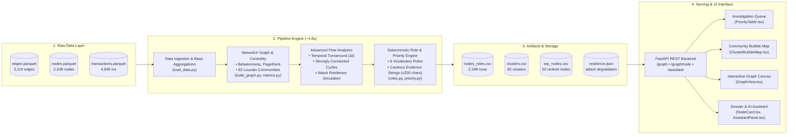

# Money Graph — AML Financial Flow Intelligence Platform

Money Graph is an end-to-end AML (Anti-Money Laundering) transaction network reconstruction and role attribution platform. It ingests bank transaction exports (`edges.parquet`, `nodes.parquet`, `transactions.parquet`), builds a directed weighted graph, computes network centrality and community metrics, deterministically attributes roles to 2,248 accounts, ranks investigation targets by priority score, and presents an interactive visual dashboard with an embedded AML AI Assistant.

---

## Quick Start (Single Command)

Start the entire platform (FastAPI backend + Next.js frontend + PostgreSQL + Redis):

```bash
docker compose up -d --build
```

- **Frontend Dashboard**: [http://localhost:3000](http://localhost:3000)
- **Backend API Docs (Swagger)**: [http://localhost:8000/docs](http://localhost:8000/docs)
- **Pipeline Execution Time**: **~5.4 seconds** for the entire graph (2,248 nodes, 3,119 edges, betweenness centrality, PageRank, Louvain communities, role assignment, and CSV generation).

To re-run the pipeline standalone:

```bash
docker compose exec backend python -m app.pipeline.run
```

Or trigger recomputation directly from the web interface using the **"Recompute"** button.

---

## Role Assignment Rules & Thresholds

Roles are evaluated sequentially from top to bottom; the **first matching rule wins**:

| Role | Priority Rule & Metric Thresholds | AML Interpretation |
| --- | --- | --- |
| **`coordinator`** | • `betweenness` in top 5% of graph (`>= 0.000155`)<br>• AND (`is_seed = true` OR connects $\ge 2$ different clusters)<br>• AND `in_partners + out_partners >= 5` | Strategic bridges linking distinct subnetworks or seed operations. Core targets for disrupting network communication. |
| **`consolidator`** | • `in_partners >= 8`<br>• AND (`pass_ratio` is undefined OR `pass_ratio < 0.3`) | Funnels funds from multiple sources into a single pooling account with minimal onward distribution (<30%). |
| **`distributor`** | • `out_partners >= 15` | Disburses funds outward to wide groups of recipients (classic layering / smurfing dispatch node). |
| **`transit`** | • `0.8 <= pass_ratio <= 1.2`<br>• AND `in_partners >= 1` AND `out_partners >= 1` | Pass-through intermediary forwarding approximately 80–120% of received funds with minimal retention. |
| **`terminal`** | • `out_partners == 0`<br>• Sub-rule: `depth < 4` (genuine sink)<br>• Sub-rule: `depth == 4` (flagged as `truncated_by_depth`, lower confidence) | Endpoint accounts. Differentiates genuine sinks from traversal boundary artifacts at hop 4. |
| **`peripheral`** | • All remaining accounts | Low-degree, low-volume background flow nodes. |

### Role Confidence (`role_score`)

Each node receives a normalized confidence score $[0.0, 1.0]$ measuring how far it exceeds the rule threshold (e.g. consolidators with 20 payers receive a higher score than those with 8). Hop-4 truncated terminal nodes receive an explicit penalty factor ($\times 0.6$).

---

## Priority Score Computation

Nodes are ranked for compliance review by `priority_score` $[0.0, 1.0]$:

$$\text{priority\_score} = \text{clip}\Big(0.35 \cdot \text{norm}(bw) + 0.25 \cdot \text{norm}(pr) + 0.20 \cdot \text{norm}(in) + 0.10 \cdot \text{norm}(out) + 0.10 \cdot is\_seed, 0, 1\Big)$$

Where:

- $\text{norm}(x) = \frac{x - x_{min}}{x_{max} - x_{min}}$ across all nodes.
- **Priority Multiplier**: Nodes classified as `coordinator` or `consolidator` receive a $1.15\times$ multiplier (clipped to 1.0) to elevate key operational actors in the investigation queue.

---

## Data Quirks & Inherent Limitations

1. **Hop-4 Traversal Truncation Artifact**:
   444 nodes with `depth = 4` and `out_partners = 0` are artifacts of the graph traversal being capped at 4 hops outward from seed clients. They must not be conflated with confirmed final recipients. The platform tags them explicitly as `truncated_by_depth = true` with cautionary evidence: *"Possible final recipient (hop 4 truncated)... needs follow-up"*.
2. **Outflow-Only Visibility**:
   The dataset records outgoing transfers from sampled clients. Inflows originating from outside the sample are not captured, and seed clients' true historical inflows appear understated.
3. **5,000 KZT Reporting Threshold**:
   Transfers below 5,000 KZT were filtered out during source extraction. Consequently, micro-structuring / smurfing below this cutoff is invisible in the raw data.
4. **16 Weakly Connected Components**:
   The network consists of 16 distinct connected components (plus 19 isolated seed accounts without edges). Louvain clustering is performed independently per component to preserve modular structure.
5. **Absence of PII / Demographic Attributes**:
   The data contains zero client demographics (names, ages, jurisdictions). All roles and priority ranks are strictly derived from graph topology and flow metrics.

---

## System Architecture



### Advanced Flow Analytics & Novelty

1. **Targeted Interdiction & Choke-Point Analysis**:
   - Baseline: Main connected core consists of **1,877 nodes** across 35 weakly connected components.
   - Disabling the top 5 coordinator bridge accounts causes the network to fragment into **129 isolated components** (reducing core size by 8.5%).
   - Disabling the top 10 coordinator accounts fractures the network into **228 components** (reducing core size by 16.5%), quantitatively proving these nodes are vital structural choke points for AML interdiction and law enforcement referral.

2. **Cycle & Return Flow Detection**:
   - Identified **309 accounts** participating in circular transaction loops across 84 cyclic subgraphs (via strongly connected components), exposing layering topologies where funds circulate back towards seed operations.

3. **Temporal Pass-Through Velocity**:
   - Extracted $\Delta t$ turnaround intervals from `transactions.parquet`. **175 accounts** exhibit rapid pass-through behavior, receiving and forwarding funds within $\le 48$ hours.

4. **Near-Cutoff Structuring Detection**:
   - Flagged **170 accounts** where $\ge 60\%$ of transfers cluster tightly between 5,000 and 15,000 KZT just above the reporting threshold.

---

## Codebase Structure

```
/data/
  raw/                          -- edges.parquet, nodes.parquet, transactions.parquet
  output/                       -- nodes_roles.csv, clusters.csv, top_nodes.csv, resilience.json
/backend/
  app/
    main.py                     -- FastAPI application & CORS
    pipeline/
      load_data.py              -- Parquet loading, temporal turnaround & structuring
      build_graph.py            -- nx.DiGraph construction
      metrics.py                -- Centrality, PageRank, Louvain communities, cycles, resilience
      roles.py                  -- Deterministic role classification & evidence
      priority.py               -- Priority scoring & multipliers
      enrich_with_llm.py        -- Optional NVIDIA NIM / OpenAI evidence polishing
      export_csv.py             -- Generates CSV files and resilience report
      run.py                    -- Pipeline entrypoint (python -m app.pipeline.run)
    routers/
      graph.py                  -- GET /graph, GET /graph/node/{gid}, GET /graph/top
      pipeline.py               -- POST /pipeline/run
      assistant.py              -- POST /assistant
    llm_clients.py              -- OpenAI / NVIDIA NIM wrapper with fallback
  Dockerfile                    -- Fast container using Astral uv
/components/
  GraphView.tsx                 -- 60 FPS HTML5 Canvas graph visualizer with directed arrows
  PriorityTable.tsx             -- Ranked investigation queue with pattern badges
  ClusterBubbleMap.tsx          -- Community bubble map sized by internal turnover
  NodeCard.tsx                  -- Persistent client dossier with flows & counterparty tables
  AssistantPanel.tsx            -- Interactive AI Assistant chat drawer
  OnboardingModal.tsx           -- 3-step first-visit guided walkthrough
/app/
  page.tsx                      -- Analyst workspace with collapsible Network Overview
  api/[...path]/route.ts        -- Dynamic backend proxy route
docker-compose.yaml             -- Multi-service orchestration
```

---

## Scaling to ~1M Nodes

Processing transaction graphs at financial-institution scale (~1M to 100M nodes, billions of edges) requires transitioning from single-node in-memory execution to streaming, partitioned architectures:

1. **First-Order Metrics via Columnar Databases**:
   - Replace in-memory Pandas aggregations with embedded columnar engines (DuckDB) or distributed SQL (ClickHouse, PostgreSQL with Citus).
   - Degree counts, directional turnover (`sum_in`, `sum_out`), and pass-through ratios are calculated via parallel grouped queries operating out-of-core without loading full graphs into RAM.

2. **Approximate & Sampled Centralities**:
   - Exact betweenness centrality has $\mathcal{O}(V \cdot E)$ complexity, which is impractical for $10^6$ nodes.
   - Employ randomized $k$-sample approximations (Brandes $k$-betweenness) or vertex-centric distributed algorithms using Apache Spark GraphX or cuGraph (GPU accelerated).
   - PageRank scales linearly via iterative MapReduce or power iteration over sparse adjacency matrices.

3. **Incremental Graph Maintenance**:
   - Rather than executing full batch recalculations, maintain graph metrics incrementally using differential dataflows. When a new transaction arrives, update local node degrees and propagate changes strictly within a bounded neighborhood radius ($k \le 2$).

4. **Persistent Distributed Graph Store**:
   - Transition from flat CSV exports to specialized graph databases (Neo4j, AWS Neptune, or Memgraph) for real-time subgraph retrieval, neighborhood traversals, and analyst path-finding queries.

---

## Generated CSV Outputs

- `data/output/nodes_roles.csv`: Exactly 2,248 rows with columns: `gid, role, role_score, cluster_id, priority_score, evidence, in_deg, out_deg, in_kzt, out_kzt, pagerank, pass_through, depth, is_seed, truncated_by_depth`.
- `data/output/clusters.csv`: 82 clusters with columns: `cluster_id, n_nodes, n_seed, sum_kzt_internal, top_gids, hypothesis`.
- `data/output/top_nodes.csv`: 50 highest priority nodes with columns: `rank, gid, role, priority_score, why`.

---

> **TODO**: substitute exact hex codes from the official Freedom Bank brand book prior to project submission if brand compliance is evaluated by the jury.
