# Money Graph — AML Financial Flow Intelligence Platform

<p align="center">
  
  
  
  
  
  
  
  
</p>

<p align="center">
  <a href="#english">English</a> • <a href="#русский">Русский</a> • <a href="#screenshots--media--скриншоты-и-демо">Screenshots & Demo</a> • <a href="#novel-research-analytics">Research & Novelty</a>
</p>

---

## Screenshots & Media / Скриншоты и Демо

> **Media Showcase Placeholder**
> Add visual assets, UI walk-through screenshots, and screen recordings below.

### Application Walkthrough Video
<!-- VIDEO: Add demo video embed / link here -->
<!-- Example: [](https://your-video-link.com) -->
<div align="center">
  <p><i>📹 [Video Demo Placeholder - Upload or link your 1-2 min video walk-through here]</i></p>
</div>

<br/>

### Key Interface Screenshots

| **Interactive Graph Visualizer (60 FPS Canvas)** | **Investigation Queue & Escalation Workflow** |
|:---:|:---:|
| <!-- SCREENSHOT: Graph Canvas View with Directed Flows and Roles --> <div align="center"><br/><i>🖼️ [Screenshot Placeholder: Canvas Graph View with Directed Flows]</i><br/><br/></div> | <!-- SCREENSHOT: Priority Queue Table with Filter Badges and Status --> <div align="center"><br/><i>🖼️ [Screenshot Placeholder: Investigation Queue with Review Badges]</i><br/><br/></div> |

| **Client Dossier & Counterparty Breakdown** | **Explain GID Trace & Rule Transparency** |
|:---:|:---:|
| <!-- SCREENSHOT: NodeCard side panel showing inbound/outbound topology --> <div align="center"><br/><i>🖼️ [Screenshot Placeholder: Client Dossier Panel]</i><br/><br/></div> | <!-- SCREENSHOT: Explain GID Modal showing exact metrics & rule condition --> <div align="center"><br/><i>🖼️ [Screenshot Placeholder: Explain GID Modal]</i><br/><br/></div> |

| **Community Bubble Map (82 Louvain Clusters)** | **Threshold Sensitivity Analysis Drawer** |
|:---:|:---:|
| <!-- SCREENSHOT: Cluster Bubble Map sized by internal volume --> <div align="center"><br/><i>🖼️ [Screenshot Placeholder: Cluster Bubble Map]</i><br/><br/></div> | <!-- SCREENSHOT: Threshold Sensitivity Panel with dynamic sliders --> <div align="center"><br/><i>🖼️ [Screenshot Placeholder: Threshold Sensitivity Panel]</i><br/><br/></div> |

| **Data Completeness & Limitation Audit** | **Law Enforcement Referral Dossier (PDF & CSV)** |
|:---:|:---:|
| <!-- SCREENSHOT: Data Completeness Modal with Hop-4 and Truncation stats --> <div align="center"><br/><i>🖼️ [Screenshot Placeholder: Data Completeness Audit Modal]</i><br/><br/></div> | <!-- SCREENSHOT: Law Enforcement Export preview / generated document --> <div align="center"><br/><i>🖼️ [Screenshot Placeholder: Law Enforcement Referral Export]</i><br/><br/></div> |

| **AI AML Assistant Drawer (Chat & Lookup)** | **Bilingual Localization (Russian UI)** |
|:---:|:---:|
| <!-- SCREENSHOT: AI Assistant panel explaining laundering typologies --> <div align="center"><br/><i>🖼️ [Screenshot Placeholder: AI Assistant Chat & Topology Q&A]</i><br/><br/></div> | <!-- SCREENSHOT: Russian Language Mode Layout --> <div align="center"><br/><i>🖼️ [Screenshot Placeholder: Russian Language UI Layout]</i><br/><br/></div> |

---

<a name="english"></a>

# English

## Overview

**Money Graph** is a full-stack, production-ready financial transaction network reconstruction and role attribution platform built specifically for financial crime compliance units, AML investigators, and law enforcement liaison teams.

The platform ingests multi-hop bank transaction exports (`edges.parquet`, `nodes.parquet`, `transactions.parquet`), builds a directed weighted graph, computes network centrality and community metrics, deterministically attributes roles to 2,248 accounts, ranks investigation targets by multi-factor priority score, simulates structural attack degradation, and provides an end-to-end case escalation and referral export workflow.

---

## Complete Feature Matrix

### 1. Core Analytics & Graph Intelligence

- **Deterministic 6-Role Taxonomy**: Sequential first-match-wins classification into `coordinator`, `consolidator`, `distributor`, `transit`, `terminal`, and `peripheral`.
- **Composite Priority Score**: Mathematically combines betweenness centrality, PageRank, in/out degrees, seed indicators, and high-impact multipliers ($1.15\times$).
- **Hop-4 Boundary Correction**: Distinguishes genuine terminal sinks from traversal truncation artifacts (444 boundary accounts) with a $0.6\times$ confidence penalty and explicit evidence flags.
- **Explain GID (Rule Chain Transparency)**: Instant modal tracing why an account received its role, displaying evaluated conditions, exact metrics, and failure reasons for preceding rules.
- **Louvain Community Partitioning**: Discovers 82 granular communities within 16 weakly connected components, computing internal transaction volume and community hypotheses.
- **Rapid Transit Velocity ($\Delta t \le 48\text{h}$)**: Identifies 175 accounts executing immediate pass-through transfers, bypassing prolonged retention.
- **Circular Flow Detection**: Detects 309 accounts trapped in 84 circular transaction loops via strongly connected components (SCC).
- **Structuring & Smurfing Pattern Alert**: Flags 170 accounts where $\ge 60\%$ of transfers cluster tightly within 5,000–15,000 KZT directly above the reporting cutoff.

### 2. Operational Investigation & Escalation Workflow

- **Analyst Investigation Queue**: Filterable, sortable priority table with pattern badges (`Seed`, `Cycle`, `Rapid`, `Smurfing`, `Hop-4 Artifact`).
- **PostgreSQL Case Review Persistence**: Tag accounts as `unreviewed`, `escalated`, or `cleared` with analyst notes and timestamps.
- **Law Enforcement Referral Dossier Export**: Generate official formatted CSV exports and clean, printable PDF referral packets ready for judicial submission.
- **Dynamic Threshold Sensitivity**: Real-time slider controls to simulate alternate coordinator betweenness percentiles, consolidator fan-in, and distributor fan-out thresholds.
- **Data Completeness & Limitation Audit**: Built-in interactive report analyzing 4 key dataset caveats: hop-4 boundary, outflow-only sampling, 5,000 KZT cutoff, and absence of demographic PII.
- **Custom Dataset Ingestion (BFS Multi-Hop)**: Upload arbitrary transaction CSVs with custom seed accounts, automatically deriving hop-depth and recalculating the entire graph.

### 3. Visual & Interactive Dashboard

- **High-Performance Canvas Graph (60 FPS)**: HTML5 Canvas rendering of 2,248 nodes and 3,119 directed edges with zoom/pan, directional arrowheads, log-scaled volume edge thickness, and role-based chromatic coloring.
- **Community Bubble Map**: Interactive packed bubble view of all 82 communities sized by internal KZT turnover.
- **Client Dossier Panel (`NodeCard`)**: In-depth account overview with inbound/outbound counterparty breakdown, transaction volumes, depth badges, and quick escalation controls.
- **AI AML Assistant (`AssistantPanel`)**: Natural language chat drawer providing topology-aware explanations, typology queries, and automatic 18-digit GID extraction with zero guilt assertions.
- **Bilingual Internationalization (EN / RU)**: Complete native English and Russian interface with instantaneous one-click toggle.
- **Onboarding Walkthrough**: 3-step interactive onboarding modal guiding first-time analysts through the investigation workflow.

---

## Quick Start (Single Command)

Spin up all services (Next.js frontend, FastAPI backend, PostgreSQL, Redis) via Docker Compose:

```bash
docker compose up -d --build
```

- **Frontend Dashboard**: [http://localhost:3000](http://localhost:3000)
- **Backend API Docs (Swagger)**: [http://localhost:8000/docs](http://localhost:8000/docs)
- **Pipeline Execution Latency**: **~1.5 – 5.0 seconds** for full graph recomputation (2,248 nodes, 3,119 edges, metrics, communities, roles, and CSV outputs).

### Standalone Pipeline Recomputation

Recompute via the **"Recompute"** button in the top navigation bar or from your terminal:

```bash
docker compose exec backend python -m app.pipeline.run
```

### Running Test Suites

```bash
# Frontend test suite (Bun — 25 passing tests):
bun test

# Backend test suite (Pytest — 26 passing tests):
backend/.venv/bin/python -m pytest backend/tests -v
```

---

## Role Assignment Hierarchy

Roles are evaluated sequentially from top to bottom; the **first matching rule wins**:

| Role | Priority Rule & Metric Thresholds | AML Operational Meaning |
| :--- | :--- | :--- |
| **`coordinator`** | • `betweenness` in top 5% of graph (`>= 0.000155`)<br>• AND (`is_seed = true` OR connects $\ge 2$ different clusters)<br>• AND `in_partners + out_partners >= 5` | Strategic bridges linking distinct subnetworks or seed operations. Core structural targets for disrupting the network. |
| **`consolidator`** | • `in_partners >= 8`<br>• AND (`pass_ratio` is undefined OR `pass_ratio < 0.3`) | Funnels funds from multiple sources into a single pooling account with minimal onward distribution (<30%). |
| **`distributor`** | • `out_partners >= 15` | Disburses funds outward to wide groups of recipients (classic layering / smurfing dispatch node). |
| **`transit`** | • `0.8 <= pass_ratio <= 1.2`<br>• AND `in_partners >= 1` AND `out_partners >= 1` | Pass-through intermediary forwarding approximately 80–120% of received funds with minimal retention. |
| **`terminal`** | • `out_partners == 0`<br>• Sub-rule: `depth < 4` (genuine sink)<br>• Sub-rule: `depth == 4` (flagged as `truncated_by_depth`, lower confidence) | Endpoint accounts. Differentiates genuine sinks from traversal boundary artifacts at hop 4. |
| **`peripheral`** | • All remaining accounts | Low-degree, low-volume background flow nodes. |

---

## Priority Score Formula

$$
priority\_score = \text{clip}\Big(0.35 \cdot \text{norm}(bw) + 0.25 \cdot \text{norm}(pr) + 0.20 \cdot \text{norm}(in) + 0.10 \cdot \text{norm}(out) + 0.10 \cdot is\_seed, 0, 1\Big)
$$

Where:

- $\text{norm}(x) = \frac{x - x_{min}}{x_{max} - x_{min}}$ across all nodes.
- **Priority Multiplier**: Nodes classified as `coordinator` or `consolidator` receive a $1.15\times$ boost (clipped to 1.0) to elevate key operational actors in the investigation queue.

---

<a name="novel-research-analytics"></a>

## Advanced Research Analytics & Novelty

### 1. Network Resilience & Interdiction Simulation

We simulated targeted interdiction attacks by systematically removing the highest-betweenness coordinator bridges:

- **Baseline**: Giant component comprises **1,877 nodes** across 35 initial components.
- **Top 5 Coordinator Removal**: The network shatters into **129 isolated components** (giant component shrinks by 8.5%).
- **Top 10 Coordinator Removal**: The network fractures into **228 isolated fragments** (giant component collapses by 16.5%), proving that freezing just 10 accounts effectively paralyzes criminal coordination across the bank's sampled perimeter.

### 2. Cyclic Laundering Topology

Identified **309 nodes** participating in circular flow structures across 84 cyclic components. Funds circulate through intermediaries and loop back toward seed-linked clusters, a hallmark of artificial turnover generation and layering.

### 3. Velocity Analysis & Rapid Pass-Through

Analyzed transaction timestamps ($\Delta t$). Found **175 nodes** where median funds transit turnaround is under 48 hours, highlighting accounts functioning purely as electronic conduits.

---

## System Architecture

```mermaid
flowchart LR
    subgraph Data["1. Data Layer"]
        D1[("edges.parquet<br/>3,119 edges")]
        D2[("nodes.parquet<br/>2,248 nodes")]
        D3[("transactions.parquet<br/>4,840 txs")]
    end

    subgraph Pipeline["2. Pipeline Engine (~4.8s)"]
        direction TB
        P1["Data Ingestion & Base Aggregations"]
        P2["NetworkX Graph & Centrality<br/>• Betweenness, PageRank<br/>• 82 Louvain Communities"]
        P3["Advanced Flow Analytics<br/>• Temporal Velocity (Δt)<br/>• Cycles & Structural Choke Points"]
        P4["Deterministic Role & Priority Engine<br/>• 6 Vocabulary Roles<br/>• Zero-Guilt Evidence Strings"]
        P1 --> P2 --> P3 --> P4
    end

    subgraph Storage["3. Persistence & DB"]
        S1[("PostgreSQL<br/>Case Reviews & Escalations")]
        S2[("Redis<br/>Pre-warmed Cache")]
        S3[("CSV / Parquet<br/>nodes_roles, clusters, top_nodes")]
    end

    subgraph UI["4. Serving & Frontend"]
        API["FastAPI Backend<br/>/graph • /reviews • /assistant • /upload"]
        FE["Next.js 16 Web Dashboard<br/>• 60 FPS Canvas Graph & Queue<br/>• Case Escalation & Referral Export<br/>• Sensitivity Panel & i18n EN/RU"]
        API <--> FE
    end

    Data --> P1
    P4 --> Storage
    Storage --> API
```



---

## Scaling to ~1M Nodes (Enterprise Blueprint)

1. **Columnar Ingestion**: Transition from Pandas to DuckDB or ClickHouse; calculate $k$-hop neighbor degree aggregates and flow ratios out-of-core.
2. **Approximate Centrality**: Replace exact $\mathcal{O}(V \cdot E)$ betweenness with Brandes $k$-sample approximations or GPU-accelerated cuGraph.
3. **Incremental Maintenance**: Propagate localized metric updates ($k \le 2$ radius) upon new transaction events rather than batch recalculation.
4. **Graph Persistence**: Store edges in Neo4j, AWS Neptune, or Memgraph for live analyst sub-graph expansions.

---

<a name="русский"></a>

# Русский

## Обзор проекта

**Money Graph** — это полнофункциональная аналитическая платформа промышленного уровня для реконструкции сетей финансовых транзакций, выявления типологий отмывания денег (AML) и детерминированной атрибуции ролей участников. Система создана для подразделений финансового мониторинга, комплаенс-расследований и подготовки материалов в правоохранительные органы.

Платформа обрабатывает выгрузки банковских переводов (`edges.parquet`, `nodes.parquet`, `transactions.parquet`), строит направленный взвешенный граф, рассчитывает метрики центральности и сообществ, присваивает роли 2 248 аккаунтам, ранжирует цели расследования по шкале приоритета, моделирует устойчивость сети при блокировке ключевых узлов и предоставляет сквозной процесс эскалации дел с выгрузкой официального досье.

---

## Полная матрица возможностей

### 1. Графовая аналитика и алгоритмическое ядро

- **Детерминированная модель из 6 ролей**: Последовательная классификация по принципу первого совпадения: координатор (`coordinator`), консолидатор (`consolidator`), дистрибьютор (`distributor`), транзитник (`transit`), терминал (`terminal`) и периферия (`peripheral`).
- **Композитный скоринг приоритета**: Расчет приоритета на основе междуузлового посредничества (`betweenness`), PageRank, входящей/исходящей степени, признака семени и повышающих коэффициентов ($1.15\times$).
- **Коррекция краевого артефакта 4-го шага**: Четкое разделение реальных терминалов и артефактов глубины графа (444 аккаунта на 4-м шаге) со штрафным коэффициентом $0.6\times$ и явной пометкой в обосновании.
- **Объяснение роли («Explain GID»)**: Прозрачное модальное окно с пошаговой цепочкой проверки правил, фактическими метриками узла и причинами несрабатывания предшествующих правил.
- **Выявление сообществ алгоритмом Louvain**: 82 устойчивых кластера внутри 16 компонент связности с подсчетом внутреннего оборота и генерацией гипотез.
- **Скоростной транзит ($\Delta t \le 48\text{ ч}$)**: Выявление 175 аккаунтов со сверхбыстрой пересылкой средств без длительного удержания на счетах.
- **Детекция циклических схем**: Обнаружение 309 аккаунтов в составе 84 замкнутых контуров (через сильно связные компоненты SCC).
- **Выявление смурфинга и дробления**: 170 аккаунтов, у которых $\ge 60\%$ операций сконцентрированы в диапазоне 5 000–15 000 KZT чуть выше порога обязательного контроля.

### 2. Рабочее место аналитика и процесс эскалации

- **Очередь расследования (Investigation Queue)**: Таблица с фильтрацией, сортировкой и бейджами типологий (`Seed`, `Cycle`, `Rapid`, `Smurfing`, `Hop-4 Artifact`).
- **Сохранение статусов в PostgreSQL**: Маркировка аккаунтов (`unreviewed`, `escalated`, `cleared`) с сохранением заметок аналитика и времени проверки.
- **Выгрузка досье для правоохранительных органов**: Генерация официального CSV-файла и аккуратного печатного PDF-досье по эскалированным фигурантам.
- **Анализ чувствительности порогов (Sensitivity Panel)**: Интерактивные слайдеры для моделирования альтернативных порогов координатора, консолидатора и дистрибьютора в реальном времени.
- **Аудит полноты данных и ограничений выборки**: Встроенный интерактивный отчет по 4 ключевым ограничениям (артефакт 4-го шага, однонаправленная выгрузка, порог 5 000 KZT, отсутствие персональных данных).
- **Загрузка пользовательских датасетов (BFS Ingestion)**: Возможность загрузить собственный CSV-файл транзакций с указанием семян, с авторасчетом глубины графа и полным пересчетом метрик.

### 3. Интерактивный интерфейс

- **Высокопроизводительный граф (Canvas 60 FPS)**: Отрисовка 2 248 вершин и 3 119 связей с масштабированием, направленными стрелками, логарифмической толщиной ребер и цветовой кодировкой ролей.
- **Пузырьковая карта сообществ**: Визуализация 82 сообществ в виде упакованных пузырьков, масштабированных по внутреннему обороту в тенге.
- **Карточка досье клиента (`NodeCard`)**: Полная аналитика по клиенту, детализация входящих и исходящих контрагентов, глубина и панель эскалации.
- **AI AML-ассистент (`AssistantPanel`)**: Чат с распознаванием 18-значных GID, ответами на вопросы о топологии сети и типологиях отмывания без субъективных обвинений.
- **Полная двуязычность (RU / EN)**: Настоящая локализация интерфейса на русском и английском языках с мгновенным переключением.
- **Обучающий тур (Onboarding)**: 3-шаговый интерактивный гид для быстрого погружения аналитика в систему.

---

## Быстрый старт (Одна команда)

Запуск всех компонентов (Next.js, FastAPI, PostgreSQL, Redis) через Docker Compose:

```bash
docker compose up -d --build
```

- **Веб-интерфейс**: [http://localhost:3000](http://localhost:3000)
- **Документация API (Swagger)**: [http://localhost:8000/docs](http://localhost:8000/docs)
- **Скорость пайплайна**: **~1.5 – 5.0 секунд** для полного пересчета всего графа (2 248 вершин, 3 119 связей, PageRank, Louvain, роли и выгрузка CSV).

### Пересчет пайплайна через консоль

```bash
docker compose exec backend python -m app.pipeline.run
```

### Запуск тестов

```bash
# Тесты фронтенда (Bun — 25 тестов):
bun test

# Тесты бэкенда (Pytest — 26 тестов):
backend/.venv/bin/python -m pytest backend/tests -v
```

---

## Исследовательская аналитика: Моделирование устойчивости сети

Мы смоделировали атаку на сеть путем удаления аккаунтов-координаторов с максимальным показателем междуузлового посредничества:

- **Базовое состояние**: Гигантская компонента связности объединяет **1 877 вершин** в 35 начальных компонентах.
- **Удаление топ-5 координаторов**: Сеть распадается на **129 изолированных компонент** (размер гигантской компоненты падает на 8.5%).
- **Удаление топ-10 координаторов**: Сеть фрагментируется на **228 изолированных фрагментов** (размер гигантской компоненты сокращается на 16.5%).

Это доказывает, что координаторы являются ключевыми структурными «бутылочными горлышками», и блокировка всего 10 аккаунтов парализует транзитные потоки между кластерами.

---

## Ограничения данных и краевые эффекты

1. **Артефакт обрезки 4-го шага (`depth = 4`)**:
   444 счета имеют `depth = 4` и `out_partners = 0` только потому, что сбор данных был остановлен на 4-м шаге от сидов. Они явно помечены флагом `truncated_by_depth = true` и получают пониженный коэффициент доверия ($\times 0.6$).
2. **Однонаправленная видимость исходящих потоков**:
   В выборку вошли только исходящие транзакции наблюдаемых клиентов. Поступления из внешних источников не зафиксированы.
3. **Порог фильтрации 5 000 KZT**:
   Переводы до 5 000 KZT отфильтрованы при первичной выгрузке, поэтому микроструктурирование ниже этой суммы не отражено в исходных данных.
4. **16 компонент слабой связности**:
   Сеть разбита на 16 независимых компонент связности. Кластеризация Louvain выполняется независимо для каждой компоненты.
5. **Отсутствие персональных данных (PII)**:
   Все выводы формируются исключительно на основе топологии графа и характеристик денежных потоков без презумпции виновности.

---

## Выходные артефакты

- `data/output/nodes_roles.csv`: 2 248 строк с ролями, метриками и объективными свидетельствами.
- `data/output/clusters.csv`: 82 кластера с гипотезами и внутренним оборотом.
- `data/output/top_nodes.csv`: ранжированный список наиболее приоритетных целей для углубленной проверки.
- `data/output/referral_dossier.csv`: экспортируемое досье эскалированных дел для правоохранительных органов.
- `data/output/resilience.json`: численные результаты симуляции фрагментации сети при исключении мостовых координаторов.
